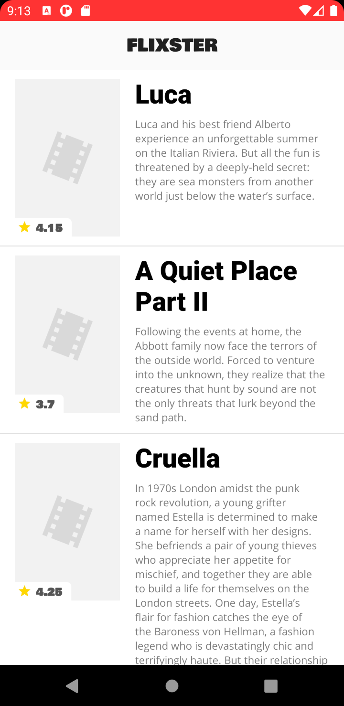

# Project 2 - *Name of App Here*

**Name of your app** shows the latest movies currently playing in theaters. The app utilizes the Movie Database API to display images and basic information about these movies to the user.

Time spent: **13** hours spent in total (5 hours on basic requirements, 8 hours on bonus stories)

## User Stories

The following **required** functionality is completed:

* [x] User can **scroll through current movies** from the Movie Database API
* [x] Display a nice default [placeholder graphic](https://guides.codepath.org/android/Displaying-Images-with-the-Glide-Library#advanced-usage) for each image during loading
* [x] For each movie displayed, user can see the following details:
  * [x] Title, Poster Image, Overview (Portrait mode)
  * [x] Title, Backdrop Image, Overview (Landscape mode)
* [x] Allow user to view details of the movie including ratings within a separate activity

The following **stretch** features are implemented:

* [x] Improved the user interface by experimenting with styling and coloring.
* [x] Apply rounded corners for the poster or background images using [Glide transformations](https://guides.codepath.org/android/Displaying-Images-with-the-Glide-Library#transformations)
* [x] Apply the popular [View Binding annotation library](http://guides.codepath.org/android/Reducing-View-Boilerplate-with-ViewBinding) to reduce boilerplate code.
* [x] Allow video trailers to be played in full-screen using the YouTubePlayerView from the details screen.

The following **additional** features are implemented:

* [x] Landscape mode is forced when video is played
* [x] The play button is only shown when the movie has a YouTube video. If there is no such video, the visibility of the button is changed.
* [x] Some items have transitions during the activity change. 

## Video Walkthrough

Here's a walkthrough of implemented user stories:

### Portrait Mode

### Landscape Mode

### Placeholders

GIF created with [Kap](https://getkap.co/).

## Notes

Describe any challenges encountered while building the app.

* Access the keys of the APIs in the different documents. There always has to be a defined context to access the resource files.
* Understanding the concept of Intents and how with these we can pass data between activities
* GET Request to get the video id. I was trying to create and return a variable in an inner class. I got help from Ellen and she explained that this is not possible, however the inner class could modify a value of the outer class.
* I think my implementation of the GET Request for the video ID was not the best. I decided to generate a field inside the Movie class and initialize it through a private method (which executes the Get Request). However, since the request is asynchronous, the user may request the movie details even when a response has not been received (so the id would be null)

## Additional features ideas for the future

* I would like to obtain information on other kinds of movies such as TopRated. Thus, I think it is possible to implement some component as a TabLayout where each fragment would represent one of the classifications.
* Include night mode. Use a component switch to change referenced values in Resource files
* Add the genres below the main photo in the detail activity through some component such as Chips (and a ChipGroup).

## Open-source libraries used

- [Android Async HTTP](https://github.com/loopj/android-async-http) - Simple asynchronous HTTP requests with JSON parsing
- [Glide](https://github.com/bumptech/glide) - Image loading and caching library for Android

## License

    Copyright [2021] [Carlos Rodríguez]

    Licensed under the Apache License, Version 2.0 (the "License");
    you may not use this file except in compliance with the License.
    You may obtain a copy of the License at

        http://www.apache.org/licenses/LICENSE-2.0

    Unless required by applicable law or agreed to in writing, software
    distributed under the License is distributed on an "AS IS" BASIS,
    WITHOUT WARRANTIES OR CONDITIONS OF ANY KIND, either express or implied.
    See the License for the specific language governing permissions and
    limitations under the License.
